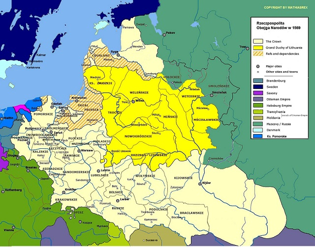
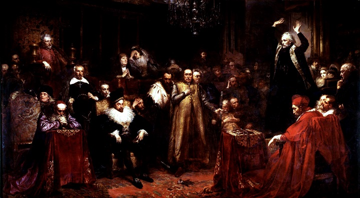
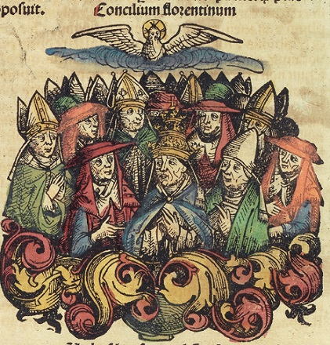
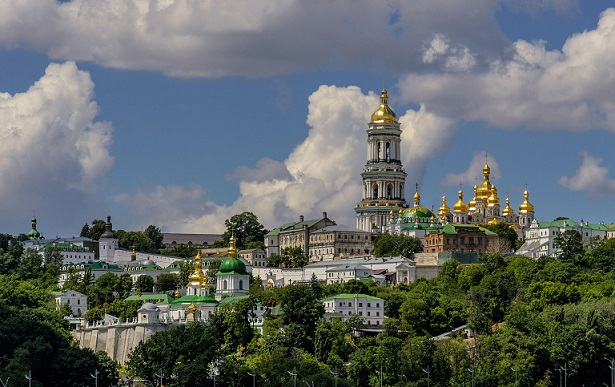
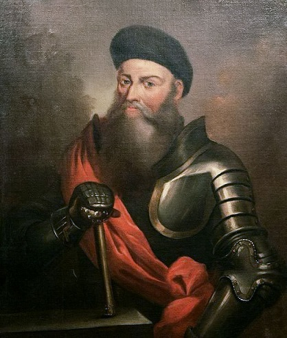
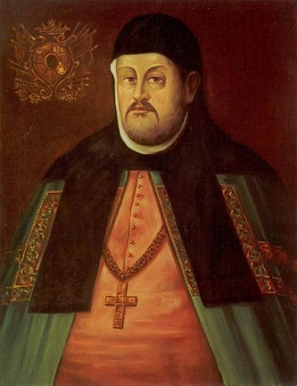

Rzadko triggerują mnie internetowe głupoty. Jednak tekst pewnego wykopka o tym, że tolerancja religijna była jedną z głównych przyczyn upadku RON mnie striggerował. Wczesnonowożytna Polska była przez pewien czas tolerancyjnym krajem na tle sąsiadów (inna sprawa, że wynikało to w dużej mierze ze sporej ilości protestantów wśród elity). Ten stan rzeczy zmieniał się jednak wraz z rośnięciem w siłę kontrreformacji*. Symbolem końca “kraju bez stosów” miało być wygnanie Braci Polskich w 1658 roku. Konflikt którego religia była ważnym elementem, a który okazał się być pocałunkiem śmierci dla I RP, zaczął się jednak dużo wcześniej.

Dokładniej to w 1596 roku, wraz z Unią Brzeską i próbą jej narzucenia prawosławnym. W tym odcinku opowiemy sobie o rzeczonej unii, ale w kolejnych odcinkach opiszę także konsekwencje. Zacznijmy od początku. Zainteresowanie Rzymu prawosławną Rusią wzrosło wraz z reformacją i przyłączeniem litewskiej Ukrainy do Korony (po unii lubelskiej). Nieco paradoksalnie, Księstwo Litewskie było raczej państwem ruskim. Znaczną część jego elit i społeczeństwa stanowili rusińscy wyznawcy prawosławia. Katoliccy Wielcy Książęta akceptowali ten stan rzeczy, bo konfesjonalizacja** nie była wówczas zbyt widoczna.

Sytuacja zaczęła się jednak powoli zmieniać. W Koronie rosły wpływy kontrreformatorów, próbujących podporządkować papiestwu przedstawicieli innych wyznań. W ewentualnym zażegnaniu schizmy z prawosławiem dostrzegali oni szansę na wzmocnienie katolicyzmu, osłabionego sukcesami protestantów. Propagatorami idei unii byli w XVI wiecznej Polsce np. Antonio Possevino, legat papieski, czy Piotr Skarga, wpływowy jezuita. Zachodnia infiltracja ziem ruskich uświadomiła prawosławnym konieczność reformy.Dostrzegali oni lepszą organizację i edukację “łacinników” oraz zapał misyjny.

Religia była wówczas kwestią tożsamości. Wierni nie mieli raczej pojęcia o teologii- identyfikowali się przede wszystkim z rytuałami i zwyczajami. Pierwszy konflikt z prawosławiem w Koronie spowodowany był wprowadzeniem kalendarza gregoriańskiego na Rusi. Juliański podkreślał starożytność wiary prawosławnej, stąd wiele cerkwi olało zarządzenie o reformie. W Boże Narodzenie 1583/4 roku katolicy próbowali przeszkodzić w świątecznych liturgiach sprawowanych we lwowskich cerkwiach. Doszło wówczas do zamieszek.

Strona prawosławna zażądała respektowania swoich zwyczajów. Król wydał wówczas specjalne rozporządzenie gwarantujące możliwość obchodzenia świąt po staremu. Presja ze strony katolików nie była jedynym problemem cerkwi. Kolejnym była jurysdykcja. Kijów był pod zwierzchnictwem patriarchy Konstantynopola, bo Bizancjum stało za chrztem Rusi. Upadek Cesarstwa w XV wieku i szukanie sojuszu z papiestwem przez część duchowieństwa greckiego doprowadziły jednak do spadku prestiżu patriarchatu. Rusińska cerkiew de facto rządziła się więc sama, a metropolitę (najważniejszego biskupa) wybierano na lokalnych synodach.

W 1588 roku patriarcha Konstantynopola, Jeremiasz, odwiedził Kijów i powołał swojego legata, który miał mieć ostatnie słowo w lokalnych sprawach. Wywołało to oburzenie części duchowieństwa. Pojawiły się głosy o konieczności reformy i uzyskania prawa do samorządu. Kolejnym czynnikiem wzmagającym zapał hierarchii był przemożny wpływ rusińskich magnatów na cerkiew. Np. nie posiadała ona prawa do wielu budynków i ziem którymi na co dzień się posługiwała. Według lokalnego zwyczaju należały one do darczyńcy. Zdarzały się czasem przypadki odbierania miejsc kultu i sprzedawania ich przez szlachtę.

Z punktu widzenia laikatu problemem rusińskiego prawosławia była kiepska kondycja moralna i słabe wykształcenie kleru. Prawosławni księża mieli dzieci i nierzadko dziedziczyły one stanowisko. W wyniku tego księża często nie byli zainteresowani religią. Problemem była także symonia, czyli kupowanie godności kościelnych (np. aby objąć bogate biskupstwo). Świadomość świeckich rosła czego przejawem były bractwa cerkiewne. Dbały one o formację laikatu i naciskały na hierarchię w sprawach dobrego prowadzenia się duchownych.

To właśnie bractwa, wobec kryzysu hierarchicznej cerkwi, brały w dużej mierze na siebie nauczanie wiary i praktyk. Niektóre z nich wprost mówiły o odrzucaniu biskupów, którzy nie byli wierni cerkiewnym zasadom. To one organizowały wydawnictwa religijne, działalność charytatywną i to one starały się przeciwstawiać katolickiej i protestanckiej działalności misyjnej. Rywalizacja o wiernych ożywiła rusińskie życie intelektualne. Pisarze religijni zaczęli tworzyć prace polemiczne, które odpowiadały na zarzuty katolików i protestantów.

Niektórzy możni również zainteresowani byli reformą. Widzieli siebie jako protektorów cerkwi, która łączyła ich z ludem i zwiększała ich niezależność od Korony. Największym “dobrodziejem” prawosławia był ród Ostrogskich, który stworzył ważny religijny ośrodek intelektualny w Ostrogu. Możni liczyli na to, że udana reforma cerkwi zwiększy jej siłę, co zaowocuje zwiększeniem pozycji szlachty ruskiej w RON. Wszystkie te trzy siły (hierarchia, laikat zrzeszony w bractwach oraz magnaci) chciał więc zmiany, ale każdy miał inne powody i inne pomysły jak miałaby ona wyglądać.

Jednym z pomysłów na reformę było zbliżenie z Rzymem, posiadającym duże zasoby i intelektualne elity. Pomysły na to zbliżenie były dwa. Jeden zakładał zjednoczenie na zasadach partnerstwa- cerkiew pozostaje cerkwią, ale uznaje papieski prymat i zostaje stowarzyszona z Rzymem. Papiestwo zaś uznaje zwyczaje i wierzenia, które nie są wprost sprzeczne z łacińskimi. Drugi pomysł zakładał całkowite podporządkowanie cerkwi rusińskiej Rzymowi z jakimiś niewielkimi koncesjami na rzecz np. rytu. Za tym optował między innymi Piotr Skarga, a idea ta była wprost pokłosiem kontrreformacji tyle, że odniesionej do Wschodu.

Wśród prawosławnej hierarchii pojawiła się grupa zwolenników unii, która chciała zmniejszenia wpływów możnych. Znaleźli się oni w konflikcie z Ostrogskim i magnatami, bo ich plany nie zakładały reformy edukacji czy obyczajów. Na to nalegali magnaci, którzy chcieli sprawnej i cieszącej się autorytetem cerkwi. Hierarchia była gotowa na unię w zamian za przywileje finansowe, prawo własności do ziemi i budynków oraz zrównanie z katolickimi biskupami (choć zdarzali się tam ludzie pragnący autentycznej reformy np. Hipacy Pociej). Dążenia do unii wspierało także otoczenie króla, widząc w nim szansę na pełniejszą integrację Ukrainy z Koroną.

W końcu to grupa hierarchiczna doprowadziła do rozmów z papiestwem. W 1595 roku stworzyła ona wstępny akt unii, zaakceptowany przez katolickich biskupów. Wywołało to sprzeciwy innych prawosławnych. Zażądano zwołania synodu argumentując to tym, że unia musi być przyjęta przez wiernych. Część hierarchów poparła to stanowisko i doszło do rozłamu wśród unionistów. Nastąpiła aktywizacja bractw prawosławnych i możnowładztwa ruskiego. Ostrogski ogłosił, że sam jest w stanie wystawić nawet 20k armię aby bronić ortodoksji.

W tym samym czasie delegacja hierarchów znalazła się w Rzymie. Artykuły które sformułowano w 95 roku nie dotyczyły za bardzo spraw dogmatycznych ani edukacji, a zabezpieczenia interesów i władzy biskupów rusińskich. W związku z tym posiłkowano się postanowieniami unii florenckiej, poprzedniej (odrzuconej przez sprzeciw wiernych) próby zakończenia schizmy. Najbardziej kontrowersyjne było przyjęcie wyznania wiary z filioque (czyli, że Duch pochodzi także od Syna) oraz uznanie nauczania o czyśćcu (obydwie te rzeczy są odrzucane przez wszystkie historyczne kościoły poza KK).

Rusińscy posłowie na sejm Rzeczypospolitej zażądali zdjęcia unickich biskupów ze stanowisk. Podobne żądania powtarzały się na lokalnych sejmikach. Rusiński laikat i część duchowieństwa odsądzały hierarchów od czci i wiary i robiły wszystko żeby zablokować wejście unii w życie. Przeciwko unii opowiedziały się także klasztory. Król zdecydował, że synod powinien potwierdzić unię, a na jego miejsce wyznaczono Brześć. Przeciwnikom udało się nań zaprosić przedstawicieli patriarchów Aleksandrii i Konstantynopola. Ci którzy liczyli na debaty srogo się jednak zawiedli.

Kością niezgody byli goście, przedstawiciele patriarchów. Zygmunt III dobrze wiedział, że patriarszy legaci reprezentują szarżę wyższą niż lokalni biskupi i mogą z łatwością pokierować synodem tak, że odrzuciłby unię. Stąd zabronił im uczestniczenia w spotkaniu. Prawosławni uznali to za jawną dyskryminację i postanowili przeprowadzić synod równolegle do unickiego. Kilkukrotnie słali oni zaproszenia do zwolenników unii, ale były one sukcesywnie ignorowane. W końcu metropolita kijowski Michał Rahoza odpowiedział im tak:

“To zostało dokonane, zostało dokonane. Teraz nie może być inaczej. Czy to co zrobiliśmy było dobre czy złe, jesteśmy >teraz częścią Zachodniego Kościoła”. 

Unicki synod ograniczył się do potwierdzenia unii zawartej w Rzymie. Wyklęto też tych którzy odrzucali unię. Prawosławny synod, mimo przeszkód ze strony władz, które zamknęły wszystkie cerkwie, również się odbył. Ogłoszono na nim zdjęcie hierarchów którzy przyjęli unię ze stanowisk i zwrócono się do króla o zaakceptowanie tych decyzji. Schizma wśród polskich Rusinów stała się faktem. Ciężko dokładnie estymować liczebność zwolenników obydwu obozów, ale wydaje się, że (przynajmniej na Ukrainie) prawosławni byli dużo liczniejsi.

Unia cieszyła się oficjalnym poparciem Korony, dlatego kolejne dwie dekady były dla jej przeciwników walką o przetrwanie. Prawosławie zostało de iure zdelegalizowane. Król Zygmunt III był wychowankiem jezuitów i gorącym zwolennikiem kontrreformacji. Poza tym widział w unii szansę na związanie Rusinów z Koroną. Wobec opozycji, unicka hierarchia zaczęła prześladować przeciwników, korzystając z królewskiego poparcia. Rekwirowano cerkwie, wypędzano duchownych, bito i aresztowano najbardziej hardych. Polityka ta odniosła relatywne sukcesy na Białorusi, ale oporu Rusinów z Ukrainy nie udało się skruszyć.

Stało się to jeszcze trudniejsze po tym jak w konflikt włączyli się kozacy, którzy z racji częstych walk z Turkami i Tatarami, uważali się za obrońców chrześcijaństwa. Grupa ta zaczynała jako mieszanka rozbójników i wolnych chłopów, ale już wówczas była prawdziwą militarną, a co za tym idzie, polityczną siłą. Konflikt religijny na Ukrainie sprawił, że połączyli oni siły z rusińską szlachtą. To m.in. dzięki nim patriarcha Jerozolimy odwiedził Kijów i wyświęcił nową prawosławną hierarchię. Kozacka interwencja zapobiegła też aresztowaniu nowych biskupów przez stronę polską.

Sojusz z kozakami sprawił, że prawosławie złapało drugi oddech. Nie podobało się to władzom państwowym i unitom. Najbardziej odbiło się to na ziemiach białoruskich. Działał tam na przykład arcybiskup Jozafat Kuncewicz, który odbierał kolejne cerkwie prawosławnym i prześladował ich wspólnoty. W trakcie wizyty w Witebsku aresztował ostatniego aktywnego batiuszkę, co doprowadziło do tumultu w którym zamordowano Kuncewicza. Spotkało się to z mocną reakcją władzy, która skazała 19 uczestników linczu na śmierć. Co ciekawe- Jozafat jest dzisiaj czczony jako katolicki męczennik.

Otrzeźwienie ze strony władz państwowych przyszło na początku panowania Władysława IV. Król i jego otoczenie dowiedziały się na przykład o coraz cieplejszych stosunkach na linii Kijów- Moskwa. Rosja, upokorzona przez Wazów na początku XVII wieku stawała się coraz mocniejsza i dyszała rządzą zemsty. Z między innymi tych przyczyn Władysław IV de facto uznał cerkiew prawosławną za istniejące i legalnie działające wyznanie. Rusińscy posłowie wybrali wówczas nowego metropolitę kijowskiego, którego godność (de facto) potwierdziły władze państwowe. Metropolitą został Piotr Mogila, który wsławił się udaną reformą cerkwi prawosławnej na Ukrainie.

Cerkiew prawosławna i unicka próbowały się teraz porozumieć i zjednoczyć. Dążenia te poparły władze Korony, ale do wspólnego synodu nie doszło z powodu sprzeciwu Rzymu. Kuria wprost zabroniła unitom udziału. Podobne inicjatywy wychodziły jeszcze co jakiś czas z obydwu stron. W 1645 Mogila i prawosławny ród Kisieli zaproponowali zjednoczenie prawosławia z unią, a co za tym idzie- Rzymem, ale nie na zasadzie poddaństwa Rusinów kurii, a równości obydwu kościołów. Propozycja ta była długo rozważana przez papiestwo. Za długo. W 1648 roku wybuchło powstanie Chmielnickiego, który na sztandary wziął nie tylko rejestr i kozackie swobody, ale także obronę prawosławia przed zakusami katolików.
