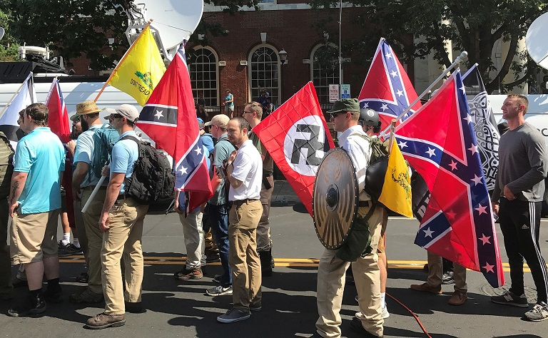
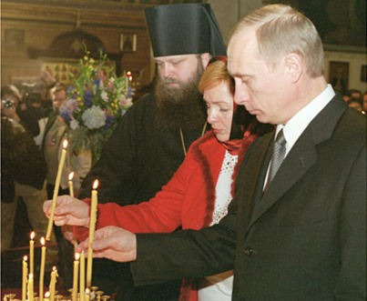
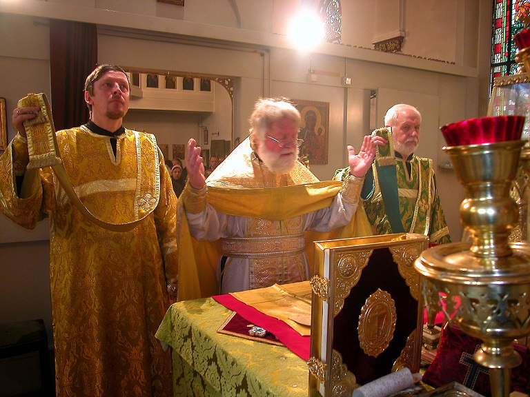

Każdy kto chociaż pobieżnie śledzi społeczno- polityczne życie Zachodu (Europa + kraje anglosaskie) musiał zauważyć pojawienie się ruchów odrzucających liberalne status quo. Z racji nacjonalistycznej retoryki i odrzucenia mainstreamowej prawicy ruchy te ochrzczono mianem alt-rightu, alternatywnej prawicy. Jest ona dość zróżnicowana ideologicznie, ale jednym z powtarzających się motywów jest przekonanie, że Zachód (różnie definiowany) upada.Jednym z przejawów tego kryzysu ma być rzekoma demoralizacja. Z tego powodu część alt-rightu szuka oparcia w religii wierząc, że jest ona ważna w dbaniu o moralność społeczeństwa.

Podejścia różnią się znacząco- od klasycznie wierzących, przez mistyków do otwartych ateistów traktujących sprawę instrumentalnie. Różne są także preferencje co do religii. Mamy tradycjonalistycznych chrześcijan (często jednak chodzi o “tradycję wynalezioną”), neopogan a nawet konwertytów na islam uważających, że tylko pod sztandarem proroka można przywrócić Zachodowi rzekomo utraconą wielkość. Pewną popularnością (zwłaszcza w USA) cieszy się także… cerkiew prawosławna. Jest to pokłosie tego, że część zwolenników alt-rightu idealizuje inne kultury i tradycję. Paradoksalne, ale logiczne. Skoro u nas rządzi marksizm/ neomarksizm/ postmodernizm, to Zachód jest zdegenerowany. Pojawia się wówczas potrzeba wskazania tej “dobrej” kultury.

Podobny mechanizm można było (o ironio!) zaobserwować w przypadku zachodnich marksistów doby zimnej wojny. Kapitalizm jak wiadomo degeneruje, prowadzi do nędzy i zniewolenia, ale taki maoizm? Maoizm to przyszłość świata! Co?! Wcale nie wymordowali, a nawet jeśli to w USA biją murzynów! Obiektem westchnień dla części amerykańskiego alt-rightu stała się Rosja. Jak to możliwe? Amerykańska debata jest mocno zafiksowana na rasie. Wraz z biegiem czasu status “w pełni białych” nadawano kolejnym grupom, np. katolikom (pierwotnie KKK był wymierzony także w nich) czy Słowianom. Ponadto- amerykański protestantyzm wykształcił na masową skalę zjawisko zwane chrześcijaństwem nie- lub ponad- denominacyjnym. To czy identyfikujesz się jako katolik czy jako nowonarodzony episkopalianin przestaje mieć znaczenie. 

Stąd wielu alt-prawicowców rozumie cywilizację Zachodu po prostu jako “białe chrześcijaństwo”. Rosjanie są biali? No są. Są chrześcijanami? No są. Komunizm się skończył? No skończył. Wniosek? Rosja jest przedstawicielem cywilizacji europejskiej. Przekaz ten wzmacniają sami zainteresowani. Rosyjska propaganda przedstawia Rosję jako kraj stojący na straży wartości chrześcijańskich i walczący z demoralizacją. Ironią jest tutaj fakt, że “w domu” Putin ochoczo pielęgnuje dziedzictwo ZSRR, bo część rosyjskiego społeczeństwa idealizuje czasy Sojuza. Że nie wspomnę o aborcjach, alkoholizmie, narkomanii, AIDS, wahabickiej Czeczeni, masowych migracjach z Azji Środkowej, biedzie, korupcji etc.

Uznanie religii za istotną w walce ze “zgnilizną” i fascynacja Rosją nie tłumaczą w pełni zainteresowania prawosławiem wśród części alt-rightu. Prawosławie łączy w sobie wiele nurtów- od mistyczno- panenteistycznych, przez ludowe, po skrajnie tradycjonalistyczne i nacjonalistyczne (wiele z nich miesza się ze sobą). Amerykańskie prawosławie jest także mocno poszatkowane jurysdykcyjnie. Istnieje także wiele grup niekanonicznych. Dodatkowo prawosławie ma długą tradycję decentralizacji- biskupi często nie byli w stanie kontrolować swoich jurysdykcji- stąd duży udział “ludu” w zarządzaniu. Z racji istnienia wielu nurtów można przyciągać różne środowiska. Prawosławie jest w USA atrakcyjne dla katolików tęskniących za tradycją. 

Dla protestantów szukających pierwotnego kościoła. Dla ludzi zorientowanych raczej na kontemplacyjne doświadczenie religijne (hezychazm). Dla ludzi rozczarowanych politycznym zaangażowaniem religii. I tak dalej. W ramach tych opcji istnieje także nurt nacjonalistyczny- reakcyjny. Odrzuca zgniły modernizm i głosi konieczność powrotu do hierarchii, porządku, wspólnoty i zasad (rzekomo utraconych). Nietrudno zauważyć, że jest on potencjalnie atrakcyjny dla zwolenników alt-rightu. Zaraz, kościół katolicki czy protestanci też mają wspólnoty zorientowane “tradycyjnie”, prawda? Tak i one też cieszą się pewną popularnością, ale dla niektórych są nie do przełknięcia. Powody są różne.

Prawosławie, obok miafizytyzmu, jest autentycznie najmniej zmienionym, historycznym wyznaniem. Do tego stopnia, że wiele cerkwi odprawia nabożeństwa w wymarłych językach. Kolejnym “atutem” jest wspomniane poszatkowanie jurysdykcyjne. W USA nie ma jednej, panprawosławnej organizacji kościelnej. Niby istnieje OCA (Orthodox Church of America) ale jej autokefalia nie jest powszechnie uznana. Niemal każda lokalna cerkiew ma sieć biskupstw i parafii w USA (co jest niekanoniczne). Kontrola jest słaba i często ogranicza się do finansów. Sieć parafialna jest rozproszona i nawet miejscowi mają słabe rozeznanie w tym co się dzieje w interiorze. Wiele parafii jest zatem mocno autonomiczna. I to działa na korzyść lokalnej wspólnoty bo może ona być tę wersją prawosławia która najlepiej trafia do lokalsów.

Konwertyta zna tylko ten wycinek który ma u siebie. Łatwo tutaj o idealizację zwłaszcza, że żeby dowiedzieć się o brzydszych stronach trzeba by znać grekę, arabski czy rosyjski albo czytać akademickie opracowania. Katoliccy tradsi mają ten problem, że wielu biskupów (nawet papież) głosi poglądy progresywne. Oczywiście robią fikołki mające jakoś tłumaczyć ich bycie w kościele mimo konfliktu z hierarchią (której są winni posłuszeństwo) czy soborem watykańskim II (nieomylnym z definicji). Część ludzi jednak tego nie kupuje. Do tego dochodzi tradycyjna niechęć (zwłaszcza na południu) do katolicyzmu. Protestantyzm ma podobny “problem”- wiele kościołów jest jeszcze bardziej progresywna. Nowsze grupy potrafią być mocno reakcyjne, ale co to za tradycja co ma 100 czy 200 lat?

Dodatkowo media co chwila donoszą o kolejnych skandalach seksualnych i finansowych u katolików i protestantów. Jest ich co niemiara, bo katolicyzm i protestantyzm to ogółem ~60% populacji USA. Prawosławni to około ~1%- totalna egzotyka, dziennikarze często nie wiedzą co to jest i skandale te są o wiele mniej nagłośnione. Skandale z krajów- matek zazwyczaj nie trafiają na pierwsze strony gazet, bo amerykanocentryzm i kogo obchodzą spory o pieniądze na katedrę w Bukareszcie skoro mało kto wie co to jest Bukareszt? O propagowanie pozytywnych informacji dbają zaś same cerkwie. Istnieją także grupy niekanoniczne, na przykład starokalendarzowe. Tam w ogóle jest jazda bez trzymanki.

Są to małe grupki, połączone w coś na kształt federacji z hierarchią, ale więzy te są często formalne i ograniczają się do wymienienia metropolity/ biskupa w dyptychach. Pole do nadużyć jest tutaj olbrzymie- prawosławiem jest to co lokalny lider mówi, że nim jest. Amerykanie nie bardzo się w tym orientują. Stąd łatwiej jest podejść potencjalnego konwertytę niż tym katolickim tradsom, których wierność tradycji postawiła za nawiasem oficjalnego katolicyzmu. Grupy te są bardzo oddane i działają często sprawniej niż kanoniczne. Amerykańskie prawosławie jest też coraz bardziej misyjne.

Przez lata cerkwie ograniczały się w zasadzie do posługi dla wspólnot imigranckich i ich potomków. To się jednak zmieniło- dla wielu ludzi z tej grupy religia była dodatkiem do tożsamości. Wraz z amerykanizacją młodszych pokoleń zaczęły one odpadać od cerkwi. Amerykańskie prawosławie ma niższy retention rate (% wychowanych w wierze którzy wyznają ją jako dorośli) niż katolicyzm (53% - 59%). Większość konwertytów to ex protestanci ze wspólnot które mocno stawiają na ewangelizację.- stąd starają się oni nawracać ludzi ze swojego otoczenia i promować swoją nową religię. Wg. danych cytowanych przez Baltimore Sun 70% członków amerykańskiej cerkwi antiocheńskiej to konwertyci. Dla wspomnianego OCA ten współczynnik to 50%. I tak w USA mariażu nacjonalistycznych nurtów prawosławia i części skrajnej prawicy stał się możliwy.

Oczywiście nawet nie próbuję sugerować, że wszyscy czy większość amerykańskich konwertytów to naziści szukający podbudowy dla swojej ideologii. Jak wspomniałem wcześniej- prawosławie jest w USA atrakcyjne dla różnych grup. Zdarzają się nawet nawróceni buddyści/ hindusi/ new-age-hippisi, którzy zainteresowali się cerkwią przez jej praktyki kontemplacyjne. Przenikanie się obydwu grup jest jednak faktem i część skrajnej prawicy dostrzega w prawosławiu sojusznika na froncie walki z “lewactwem”. Najlepiej oddać głos samym zainteresowanym (poniższa wypowiedź pochodzi ze skrajnie prawicowego serwisu Vanguard News Network):

"Koniec końców prawosławne kraje pozostały bardziej jednolite rasowo i kulturowo niż laickie lub, co gorsza, protestanckie. Prawosławie jest jednym z najważniejszych powodów dla którego Grecy, Rosjanie czy Serbowie rozumieją kwestię żydowską lepiej niż jakikolwiek członek Twojego studenckiego klubu ateistów."

Sytuacja w USA nie jest zresztą wyjątkowa, bo podobne rzeczy działy się (i dzieją) “w domu”. Współcześnie znane są związki Złotego Świtu z częścią duchowieństwa greckiego. Wielu ukraińskich duchownych otwarcie popiera nacjonalistów oraz ich ataki na cerkwie i laikat wierny moskiewskiej metropolii. Podobnie rzecz ma się w Rosji gdzie istnieje nie tylko sojusz z Putinem, ale także sojusze części duchowieństwa z organizacjami nacjonalistycznymi, które są na tyle silne, że wpływają na centralne władze (np. Narodny Sobor). Hierarchia w USA długi czas nawet nie zdawała sobie sprawy z występowania takiego zjawiska. Amerykańska opinia publiczna której “prawosławny” (ang. “orthodox”) kojarzy się raczej z żydami też nie. 

Pierwsze doniesienia na ten temat pochodziły od organizacji antyrasistowskich. Na demonstracjach organizowanych przez skrajną prawicę zaczęła pojawiać się symbolika prawosławna (charakterystyczne krzyże z trzema belkami czy przeróbki konfederackich flag z hasłem IC XC NIKA- Jezus Chrystus Zwycięzca). Rosnąca widoczność skrajnej prawicy sprawiła, że Rada Kanonicznych Cerkwi w USA wydała w 2017 roku rezolucję potępiającą rasizm i nienawiść na tle etnicznym. To jednak za bardzo nie przeszkadza części “wiernych”. Nawet w przypadku imiennych ekskomunik (co miało miejsce np. w przypadku grupy TradYouth) mogą sobie zawsze pójść do starokalendarzowych/ innych niekanonicznych cerkwi i dalej uważać się za prawosławnych.
