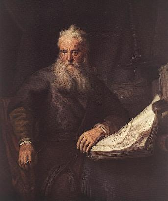
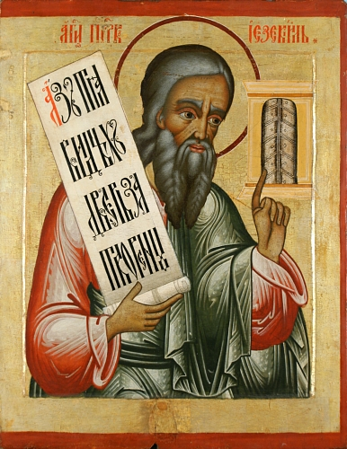
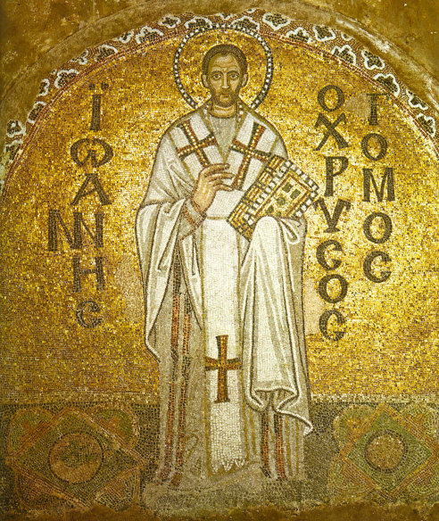
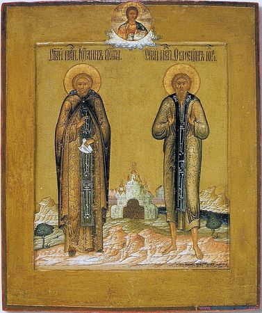
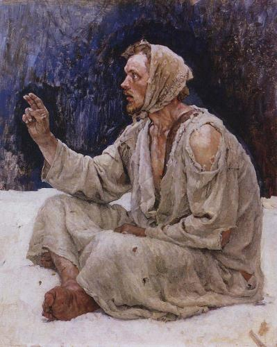
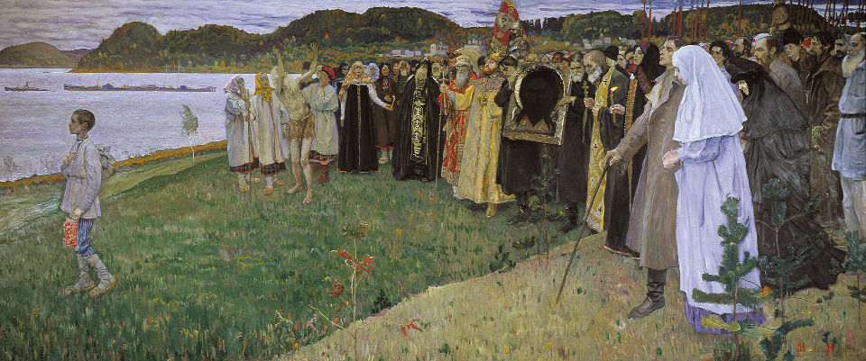

Po przeczytaniu tytułu zapewne myślisz sobie, drogi czytelniku, coś w stylu: “kurła, nie przenoś mnie tu
gimboateizmu11”. Uspokajam- to nie gimboateizm. Głupota o której mowa ma bowiem inne znaczenie. Bear with me. W prawosławiu istnieje specjalna kategoria ascetów zwanych “Głupcami Chrystusowymi” (grek. saloi, ros. iurodivye, pol.- jurodiwy). O ile “klasyczny” ascetyzm polega na odcięciu się od świata to jurodstwo celowo żyje w “świecie”. I, zgodnie z nazwą, zasadza się na robieniu głupot. Nie są to jednak zwykłe głupoty- są to głupoty dla idei, ad maiorem dei gloriam.

Jako teologiczną podstawę jurodstwa podaje się zazwyczaj ten fragment pawłowego listu do Koryntian. Głupotą są tutaj boże zamysły, których ludzie nie rozumieją i dlatego biorą je za głupotę:

"Niechaj się nikt nie łudzi! Jeśli ktoś spośród was mniema, że jest mądry na tym świecie, niech się stanie głupim, by posiadł mądrość. Mądrość bowiem tego świata jest głupstwem u Boga."

Cele jurodstwa są wielorakie. Jednym z nich jest poniżenie ascety. Raczej mało kto patrzy przychylnie na bełkoczącego, zarośniętego bezdomnego, prawda? A tak właśnie wyglądają jurodiwy, Jest to tłumaczone z jednej strony jako przezwyciężenie jednostkowej dumy, rozumianej tu jako “matka wszystkich grzechów” (patrz finał Adwokata Diabła). Z drugiej strony jurodstwo to także sposób na podkreślenie obecności Boga w każdym, nawet “najgorszym” człowieku i ważności jednostki. Bezdomy, szalony żebrak może być natchniony przez Boga i użyteczny w celu jaki Stwórca postawił przed stworzeniem.

Robienie pozornie szalonych lub głupich rzeczy ma także służyć wyrywaniu ludzi z ich przyzwyczajeń. Celem jest natchnienie obserwatora/ słuchacza aby zastanowił się, wyszedł z domyślnego stanu w którym jego zachowanie i myśli wynikają z bezmyślnego podążania znanymi sobie ścieżkami. Myślenie o sprawach które wydawały się oczywiste ma zaś pomóc wiernym znaleźć Prawdę (wielką literą!) czyli Boga. Co ciekawe- niekonwencjonalne zachowania dotyczą także spraw religijnych, co w mocno sformalizowanym i zrytualizowanym prawosławiu prowadziło czasem do podejrzeń jurodiwych o herezję.

Tradycja upatruje korzeni jurodstwa u starotestamentowych proroków, którzy działali według mądrości osiedli: “albo grubo, albo wcale”. Na przykład Izajasz miał jakoby wędrować przez trzy lata bez obuwia i odzienia po pustyni, zwiastując w ten sposób niewolę egipską. Ezechiel z kolei otrzymał od Boga polecenie jedzenia placka pieczonego publicznie na “nawozie ludzkim” i odprawienie dziwacznej, publicznej pokuty (miłosierny Bóg w końcu jednak zezwolił Ezechielowi piec placki na nawozie wołowym). Z kolei Ozeasz, na rozkaz boży, poślubił prostytutkę, która powiła dzieci będące owocem jej “kariery”. Przy okazi Bóg zabronił Ozeaszowi konsumpcji związku.

Zdaniem uczonych (a przynajmniej części z nich) jest to dość naciągana interpretacja. Tradycja ma na ten temat inne zdanie. Kolejne, biblijne wzmianki które można zrozumieć jako mówiące o Głupcach pochodzą także z pism św. Pawła:

"my głupi dla Chrystusa, wy mądrzy w Chrystusie, my niemocni, wy mocni; wy doznajecie szacunku, a my wzgardy. Aż do tej chwili łakniemy i cierpimy pragnienie, brak nam odzieży, jesteśmy policzkowani i skazani na tułaczkę, i utrudzeni pracą rąk własnych. Błogosławimy, gdy nam złorzeczą, znosimy, gdy nas prześladują; dobrym słowem odpowiadamy, gdy nas spotwarzają. Staliśmy się jakby śmieciem tego świata i odrazą dla wszystkich aż do tej chwili."

Co jest dość trafnym opisem ideału Głupca dla Chrystusa, które to określenie pada tam wprost. Przeciwstawienie “głupoty” zawierzenia Jezusowi filozofii odwołującej się do rozumu było motywem który czasem pojawia się u Ojców Kościoła. Oczywiście w ich mniemaniu to właśnie przedkładanie Rozumu nad Objawienie było głupotą, bo przecież Bóg wie najlepiej. To nazywanie siebie głupcem było więc czymś w rodzaju używania “słowa na n” przez Afroamerykanów w stosunku do siebie samych. Jan Chryzostom, ojca kościoła, pisał tak:

"Kiedy Bóg coś objawi, trzeba to przyjąć z wiarą i nie dzielić włosa na czworo [...] Niech mnie nazywają [...] głupcem w Chrystusie a będę dumny z tego miana jak z korony zwycięzcy. Ponieważ dzielę to miano z Pawłem, który powiedział: ''Jesteśmy głupcami dla Chrystusa''."

Pierwszym kanonizowanym Głupcem by Symeon (VI wiek). Hagiografia podaje, że zaczynał on jako “zwykły” asceta, niejako ukazując jurodstwo jako wyższy lvl. Żyjąc na pustyni Symeon osiąga apatheię (“wolność od patologicznych rządz”). Zaraz potem Bóg poleca mu żyć wśród ludzi i nawracać. Natchniony uznaje, że najlepsze efekty osiągnie uchodząc za szaleńca. Wkracza do Emesy wlokąc ścierwo psa. Ludzie uznają go za wariata i częstują gradem kamieni. Symeon lekce sobie waży ich ataki i wkracza do kościoła. Po zapaleniu wotywnych świec, obrzuca zgromadzonych na liturgii wiernych orzechami, za co spotyka go srogi oklep od bogobojnej owczarni.

Następuje seria zdarzeń która jednoznacznie ukazuje mieszkańcom, że mają do czynienia ze świrem. Dzieje się jednak coś dziwnego, bo rzeczony świr zaczyna dokonywać cudów, wygania demony i przewiduje przyszłość. Ukrywa się jednak z pobożnością aby zwalczyć pychę a jego świętość i religijne życie wychodzą na jaw dopiero po śmierci. Żywot świętego Symeona dobrze oddaje ideał Głupca Chrystusowego i wyznacza pewien kanon zachowań dla naśladowców. Oprócz dziwacznego zachowania i ukrywania się z pobożnością Symeon jest agresywny i głośny a nawet w otwarty sposób łamie zasady religijne (np. jedząc mięso w post).

Mimo to zostaje kanonizowany przez kościół ortodoksyjny, a za nim podobni doń asceci- Izydora, Serapion, Besarion Cudotwórca, Tomasz czy Andrzej z Konstantynopola. Z czasem jednak hierarchia bizantyjska zaczyna patrzeć na Głupców z rosnącą podejrzliwością. Utrudnia im życie, nasyła władze, a duchowni gromią takie zachowania. Wg. badaczy do X wieku zjawisko Głupców praktycznie zamiera wśród bizantyjskich chrześcijan. Głupcy ogłoszeni świętymi są jednak nadal czczeni i, jako bliscy ludowi, cieszą się popularnością, a poświęcone im hagiografie są poczytne.

Prace te trafiają w końcu na Ruś Kijowską, która przyjęła chrzest z Konstantynopola. Tam Głupcy zyskują nowe życie. Literackie źródła świadczące o ich popularności pojawiają się w XIV wieku. Motyw trafia na podatny grunt, bo tradycja chrześcijańska splata się z ludowym Iwanem Durakiem (Głupkiem). W przekazach Iwan jest prostaczkiem, niezbyt lotnym, ale cieszącym się nadprzyrodzoną opieką. Koniec końców, to on okazuje się tym dobrym i uczciwym (motyw ten często przewija się rosyjskiej kulturze, także współcześnie, np. 25/17- Русский подорожник).

Niektórzy z jurodiwych, mimo bycia dość szorstkimi w obyciu, cieszyli się dużym szacunkiem i sławą. Dobrze widać to w zapiskach XVI wiecznego angielskiego posła wizytującego dwór cara, Gilesa Fletchera.

"[...] posiadają oni eremitów, których zwą świętymi mężami, a którzy z powodu swego stylu życia są jak gimonsofiści [nadzy mędrcy] choć nie dorównują ich wykształceniu. Mają oni w zwyczaju chodzić nago, w samej przepasce biodrowej, nieostrzyżeni. Wielu z nich nosi żelazne łańcuchy lub kołnierze. Chodzą tak nawet w środku bardzo mroźnej zimy. Są brani za proroków i świętych i z tego powodu mogą mówić co im się podoba, nawet o samym Najwyższym [...] jeśli któryś z nich zabierze coś ze sklepu bez płacenia, kupiec uważa, że spotkało go wielkie błogosławieństwo [...] Pewnego razu jeden z nich chodził nago po Moskwie i wykrzykiwał hasła przeciwko państwu i rządzącym [...] Kilka lat temu zmarł jeden z nich zwany Wasylem, który otwarcie krytykował cara za jego opresje i okrucieństwa wymierzone w lud [...]"

Wspomniany we fragmencie Wasyl to Wasyl Błogosławiony (tak, ten z Kremla) a car to Iwan Groźny, który krwawo rozprawiał się z krytykantami. Nawet on nie odważył się jednak ruszyć Wasyla. Popularni jurodiwy byli postrzegani jako święci i personifikacja prostego ludu. Nie znaczy to jednak, że każdy jurodiwy był uwielbianym “celebrytą”. Wybaczcie autorsko- amatorską antropologię, ale porównałbym ich do muzyków rockowych. Skandalistów jest (było) tam co niemiara, ale podziw udało się zaskarbić tylko niektórym. I podobnie jak z gwiazdami rocka, oprócz fanów są też hejterzy (to raczej hiphopowe określenie, ale co tam).

Dla części ludzi sposób zachowania i komunikacji Głupców były nie do przyjęcia. Uważali ich nie za świętych dążących do unii z Bogiem, a za szalonych i szkodliwych. Szczególne kontrowersje wzbudzały takie akcje jak przebywanie w towarzystwie prostytutek czy wchodzenie w samej przepasce do cerkwi czy agresywne zachowanie. Zdarzały się przypadki pobić i samosądów na Głupcach (że już nie wspomnę o wyzwiskach i groźbach). Była to jednak część ich sposobu bycia- wszak jurodstwo polegało także na poniżeniu. Sława i uznanie były wypadkiem przy pracy, pogarda czy przemoc były normą.

Kolejną rzeczą która mogła wpakować Głupca w kłopoty był antyklerykalizm. Jako asceci i odrzucający konwenanse często krytykowali kler jako zbyt skupiony na rytuałach i hierarchiach. Ponadto zdarzało się, że ich poglądy religijne odbiegały od oficjalnych. Głupcy zdają się balansować na granicy ortodoksji i herezji oraz ludowych wierzeń i i instytucjonalnej religii. Zdaniem niektórych badaczy kanonizacje jurodiwych to próby zawłaszczenia ludowych świętych, mające na celu przybliżyć oficjalną religię do ludowej. Pojawiają się jednak inne głosy wskazujące, że Głupcy nie atakowali cerkwi jako takiej, a starali się eksponować duchową, praktyczną stronę religii w miejsce ceremonialno- dogmatycznej.

Ruska cerkiew beatyfikowała około 40 osób będących Głupcami. Tradycja ta jest tam żywa przy czym w XIX wiek Rosja była świadkiem eksplozji popularności Głupców- zarówno na wsiach jak i w miastach. Literatura tego okresu zaświadcza o popularności jurodstwa. Postacie takie przewijają się u Tołstoja, Dostojewskiego, Uspienskiego czy Leskowa. Kres masowości tego zjawiska kładą komuniści i ich walka z religią. Jako się rzekło Głupcy nie zniknęli- w ruskim prawosławiu istnieją bowiem po dziś dzień.
