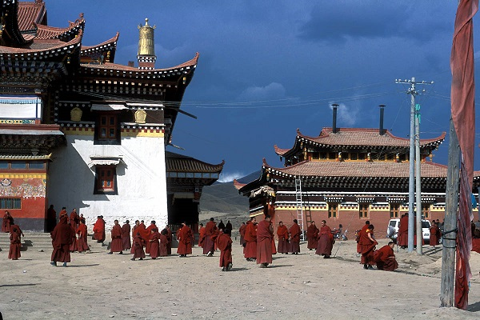

Tybet przeciętnemu Europejczykowi kojarzy się automatycznie z Dalajlamą, klasztorami i buddyzmem. Jednak zanim w VIII w. n. e. nauki Buddy dotarły na Wyżynę Tybetańską, rozkwitała tam osobliwa religia szamańsko-animistyczna: bön (pełna nazwa to Jungdrung Bön). Jest ona na tyle silnie zakorzeniona w kulturze Tybetańczyków, że tamtejsza odmiana buddyzmu wchłonęła z niej wiele elementów, tworząc całkiem nową religię.

Początku bön są dosyć niejasne, wyznawcy sięgają do czasów prehistorycznych (16 tys. lat p.n.e.) kiedy pierwotne formy tej religii miały pojawić się w Tybecie („pierwotny bön”). Tradycja ta wywodzi się od starożytnej, mitologicznej postaci Tenpy („nauczyciela”) Szenraba Miłocze, pochodzącego najprawdopodobniej z Persji lub dzisiejszego Tadżykistanu (uważanego potem za pierwsze wcielenie Buddy). Według legend usystematyzował on szereg wierzeń, obrzędów, mitów, zaklęć i tradycji, często sprzecznych ze sobą. Bön chłonął także wpływy manicheizmu i zaratusztranizmu. Od tej pory religia spokojnie rozwijała się jako „stary bön” - kult różnych bóstw, demonów i praktyk magicznych wykonywanych przez szamanów. Spokojnie, dopóki do Tybetu nie wkroczył buddyzm. W II poł. VIII w. n. e. na zaproszenie króla Trisonga Decena do Tybetu przybył Padmasambawa – wielki nauczyciel buddyjski, który według legend poskromił lokalne bóstwa oraz demony i nakłonił je do szerzenia buddyzmu*. Odtąd bön było tępione, jako przeszkoda w rozprzestrzenianiu się nowej, oświeconej religii. Role odwróciły się niedługo potem – wnuk króla Trisonga – Langdharma był zagorzałym przeciwnikiem buddyzmu i próbował go usunąć z Tybetu. Po jego śmierci buddyzm powrócił i obie religie zaczęły współistnieć koło siebie.

W X-XI w. bön i buddyzm zaczęły na siebie wywierać wpływ i mieszać się nawzajem. Powstał tzw. „nowy bön”, łączący cechy obu religii. Z tego względu ciężko jest określić jak wyglądał bön przed pojawieniem się buddyzmu – zachowało się mało źródeł z tamtego okresu, a późniejsze teksty buddyjskie i z tradycji bön są do siebie bardzo podobne, na wskutek kopiowania treści wyznawców obu religii nawzajem. Nowy bön może być mylony z buddyzmem tybetańskim – podstawą jest doktryna, że że świat jest miejscem cierpienia i konieczne jest oświecenie przed medytację i praktyki religijne. Z pomocą przychodzą bogowie i demony - modlitwy i ofiary im składane pomagają uniknąć cierpienia. Praktyki magiczne zas przywracają harmonię w naturze. Jednak wiele obrzędów jest innych, aby odróżnić bön od buddyzmu – wierni okrążają swoje świątynie w prawo, odwrotnie niż buddyści, a swastyka w bön jest lewoskrętna. Jednocześnie buddyzm tybetański przejął wiele od bön – przesądy, wyrocznie, czary i magię oraz wiarę w bóstwa, oddalając się od pierwotnej wersji nauk Buddy**. Podobnie jak w buddyzmie, w bön istnieją dwie linie przekazu nauk – jedna nieprzerwana od Szenraba Miłocze, a druga od tzw. „ukrytych skarbów” – świętych tekstów i relikwii pochowanych przez nauczyciela w różnych zakątkach Tybetu, które miały być znajdowane i miały za zadanie podtrzymywać kult bön (łudząco podobny zabieg z tekstami buddyjskimi zastosował Padmasambawa). Na przestrzeni wieków wielcy mistrzowie odkrywali „ukryte skarby”, pojmowali ich głębię i przekazywali nauki wiernym.

Teksty i święte miejsca bön zostały w większości zniszczone po aneksji Tybetu, w czasie Rewolucji Kulturalnej w Chinach. Obecnie po latach dyskryminacji, buddyjscy duchowni przyznają miejsce religii bön w życiu Tybetańczyków i odkrywają w niej korzenie buddyzmu tybetańskiego. Zwierzchnikiem bön jest 89-letni najstarszy nauczyciel tej religii i 33. opat klasztoru Menri (głównego ośrodka bön) - Lungtok Tenpai Nyima. W 1977r. duchowy przywódca Tybetańczyków Dalajlama Tenzin Gjaco zapoznał się z naukami Jungdrung Bön i uznał go za piątą tradycję Tybetu, obok czterech buddyjskich szkół. Członkowie wszystkich pięciu tradycji wchodzą w skład Tybetańskiego Rządu na Uchodźctwie. Nauki bön są popularyzowane na Zachodzie równoległe z buddyzmem, a najprężniejsze ośrodki działają we Francji, w Niemczech, Austrii i w Polsce.

*Co ciekawe, rytuał „poskramiania” i zjednywania sobie lokalnych bóstw ma miejsce do dzisiaj przy okazji budowy klasztorów buddyjskich, np. podczas budowy klasztoru i stupy w Grabnikach k.Grodziska Mazowieckiego w 2012r.

**Gdyby Budda Siakjamuni zobaczył tybetańską wersję buddyzmu, mógłby się mocno zdenerwować (mocno jak na Buddę). W jego założeniach buddyzm miał być oparty na filozofii, a nie na rytuałach, tak jak to miało miejsce w przypadku hinduistycznych tradycji, z których się wywodził.